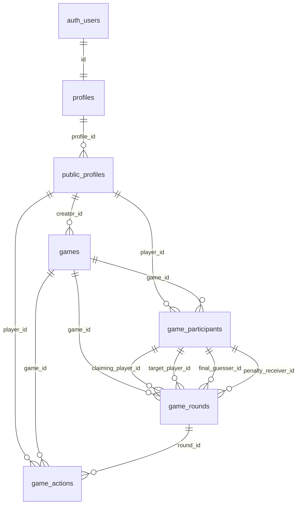

# G-Poker Data Model

## Overview

G-Poker uses a simplified, secure database architecture built on Supabase PostgreSQL with Row Level Security (RLS). The design prioritizes data integrity, security, and performance for real-time Cockroach Poker (ごきぶりポーカー) gameplay.

## Database Schema

### ENUM Types

```sql
-- Creature types for the 4 types of cards in Cockroach Poker
CREATE TYPE creature_type AS ENUM ('cockroach', 'mouse', 'bat', 'frog');

-- Game status for game lifecycle management
CREATE TYPE game_status AS ENUM ('waiting', 'in_progress', 'completed', 'cancelled');

-- Player status for participation tracking
CREATE TYPE player_status AS ENUM ('joined', 'playing', 'disconnected', 'left');
```

### Core Tables

#### 1. profiles (Authentication Core)
Primary authentication table linked to Supabase auth.users.

```sql
CREATE TABLE profiles (
  id UUID PRIMARY KEY REFERENCES auth.users(id),
  email VARCHAR,                          -- User email
  created_at TIMESTAMPTZ DEFAULT NOW(),   -- Account creation
  updated_at TIMESTAMPTZ DEFAULT NOW(),   -- Last update
  last_seen_at TIMESTAMPTZ DEFAULT NOW(), -- Last activity
  is_active BOOLEAN DEFAULT TRUE          -- Account status
);
```

**Purpose**: Core authentication and account management
**Security**: RLS enabled, users can only access their own profile

#### 2. public_profiles (Player Information)
Public player data and Cockroach Poker statistics.

```sql
CREATE TABLE public_profiles (
  id UUID PRIMARY KEY DEFAULT uuid_generate_v4(),
  profile_id UUID REFERENCES profiles(id),     -- Links to authentication
  display_name VARCHAR,                         -- Player display name
  avatar_url TEXT,                             -- Player avatar
  verification_status VARCHAR DEFAULT 'unverified', -- Trust level

  -- Game statistics
  games_played INTEGER DEFAULT 0,              -- Cockroach Poker games played
  games_won INTEGER DEFAULT 0,                 -- Games won
  win_rate NUMERIC DEFAULT 0.0,               -- Win percentage

  -- Onboarding & Tutorial
  tutorial_completed BOOLEAN DEFAULT FALSE,    -- Has completed Cockroach Poker tutorial
  tutorial_completed_at TIMESTAMPTZ,          -- When tutorial was completed
  onboarding_version VARCHAR DEFAULT '1.0.0', -- App version when onboarded

  created_at TIMESTAMPTZ DEFAULT NOW(),
  updated_at TIMESTAMPTZ DEFAULT NOW()
);
```

**Purpose**: Public player information, game statistics, and onboarding state
**Verification Levels**: `unverified`, `pending`, `verified`, `rejected`, `suspended`
**Onboarding**: Tracks tutorial completion for first-time user experience
**Security**: Accessible based on privacy settings and verification status

#### 3. games (Cockroach Poker Sessions)
Manages Cockroach Poker game sessions and their lifecycle.

```sql
CREATE TABLE games (
  id UUID PRIMARY KEY DEFAULT uuid_generate_v4(),
  creator_id UUID REFERENCES public_profiles(id),  -- Game creator
  status game_status DEFAULT 'waiting',            -- Game state (ENUM)
  max_players INTEGER DEFAULT 2,                   -- Always 2 for Cockroach Poker
  current_player_count INTEGER DEFAULT 0,          -- Current count
  current_turn_player_id UUID REFERENCES public_profiles(id), -- Whose turn
  round_number INTEGER DEFAULT 0,                  -- Current round
  time_limit_seconds INTEGER DEFAULT 30,           -- Action time limit (seconds)
  hidden_card_count INTEGER DEFAULT 6,             -- Cards not dealt (6 remain hidden)
  game_deck JSONB,                                -- 24 creature cards storage
  created_at TIMESTAMPTZ DEFAULT NOW(),
  updated_at TIMESTAMPTZ DEFAULT NOW()
);
```

**Status Values**: `waiting`, `in_progress`, `completed`, `cancelled` (game_status ENUM)
**Game Deck**: 24 creature cards (6 each of cockroach, mouse, bat, frog)
**Card Distribution**: 9 cards per player, 6 remain hidden
**Security**: References public_profiles for enhanced security isolation

#### 4. game_participants (Player-Game Relationships)
Tracks players in Cockroach Poker games with their cards and penalty status.

```sql
CREATE TABLE game_participants (
  id UUID PRIMARY KEY DEFAULT uuid_generate_v4(),
  game_id UUID REFERENCES games(id) ON DELETE CASCADE,
  player_id UUID REFERENCES public_profiles(id) ON DELETE CASCADE,
  status player_status DEFAULT 'joined',       -- Player state (ENUM)
  position INTEGER CHECK (position IN (1, 2)), -- Player 1 or Player 2

  -- Player's hand (private cards)
  hand_cards JSONB DEFAULT '[]',               -- Array of card objects

  -- Penalty pile by creature type (Cockroach Poker core mechanic)
  penalty_cockroach JSONB DEFAULT '[]',        -- Cockroach penalty cards
  penalty_mouse JSONB DEFAULT '[]',            -- Mouse penalty cards
  penalty_bat JSONB DEFAULT '[]',              -- Bat penalty cards
  penalty_frog JSONB DEFAULT '[]',             -- Frog penalty cards

  -- Game state tracking
  cards_remaining INTEGER DEFAULT 9,           -- Cards left in hand
  has_lost BOOLEAN DEFAULT FALSE,              -- Lost the game
  losing_creature_type creature_type,          -- Which creature caused loss (ENUM)

  joined_at TIMESTAMPTZ DEFAULT NOW(),
  updated_at TIMESTAMPTZ DEFAULT NOW()
);
```

**Status Values**: `joined`, `playing`, `disconnected`, `left` (player_status ENUM)
**Penalty Piles**: Separate JSONB arrays for each creature type (lose when 3 of same type)
**Position**: Exactly 2 players (position 1 and 2)
**Security**: References public_profiles for secure player identification

#### 5. game_rounds (Card Passing Rounds)
Manages individual card passing rounds within Cockroach Poker games.

```sql
CREATE TABLE game_rounds (
  id UUID PRIMARY KEY DEFAULT uuid_generate_v4(),
  game_id UUID REFERENCES games(id) ON DELETE CASCADE,
  round_number INTEGER NOT NULL,

  -- Current card being passed
  current_card JSONB NOT NULL,                -- Card object with creature type

  -- Claim information (SECURE: references game_participants for game-scoped security)
  claiming_player_id UUID REFERENCES game_participants(id) NOT NULL,
  claimed_creature_type creature_type NOT NULL, -- What player claims it is (ENUM)
  target_player_id UUID REFERENCES game_participants(id) NOT NULL,

  -- Round state
  pass_count INTEGER DEFAULT 0,               -- Times card passed back
  is_completed BOOLEAN DEFAULT FALSE,

  -- Final resolution (SECURE: references game_participants for game-scoped security)
  final_guesser_id UUID REFERENCES game_participants(id), -- Who made final guess
  guess_is_truth BOOLEAN,                     -- Guess: true or false
  actual_is_truth BOOLEAN,                    -- Reality: was claim true
  penalty_receiver_id UUID REFERENCES game_participants(id), -- Who got penalty

  created_at TIMESTAMPTZ DEFAULT NOW(),
  completed_at TIMESTAMPTZ,
  updated_at TIMESTAMPTZ DEFAULT NOW()
);
```

**Round Flow**: Card claim → guess/pass → penalty assignment
**Claims**: Player claims card is a specific creature type (can be lie)
**Security Enhancement**: All player references use game_participants(id) for game-scoped access control

#### 6. game_actions (Player Actions)
Records all player actions during Cockroach Poker gameplay.

```sql
CREATE TABLE game_actions (
  id UUID PRIMARY KEY DEFAULT uuid_generate_v4(),
  game_id UUID REFERENCES games(id) ON DELETE CASCADE,
  round_id UUID REFERENCES game_rounds(id) ON DELETE SET NULL,
  player_id UUID REFERENCES public_profiles(id) ON DELETE CASCADE,

  action_type VARCHAR NOT NULL CHECK (action_type IN (
    'join_game', 'leave_game', 'start_game',
    'pass_card', 'make_claim', 'guess_truth', 'guess_lie', 'pass_back',
    'receive_penalty', 'game_end'
  )),

  action_data JSONB DEFAULT '{}',              -- Action details
  created_at TIMESTAMPTZ DEFAULT NOW()
);
```

**Action Types**: Cockroach Poker specific actions
- `join_game`: Player joins the game
- `leave_game`: Player leaves the game
- `start_game`: Game is started
- `pass_card`: Player passes card with claim
- `make_claim`: Player claims card is specific creature type
- `guess_truth`: Player believes claim is true
- `guess_lie`: Player believes claim is false
- `pass_back`: Player passes card back instead of guessing
- `receive_penalty`: Player receives penalty card
- `game_end`: Game has ended

**Action Data**: Card IDs, creature types, claim details stored as JSONB
**Security**: References public_profiles for player identification

## Security Architecture

### Row Level Security (RLS)
All tables implement RLS policies for data isolation:

```sql
-- Users can view games they participate in
CREATE POLICY "Users can view games they participate in" ON games
FOR SELECT USING (
  id IN (
    SELECT game_id FROM game_participants
    WHERE player_id = auth.uid()
  )
);

-- Authenticated users can create games
CREATE POLICY "Authenticated users can create games" ON games
FOR INSERT WITH CHECK (auth.role() = 'authenticated');
```

### Verification System
Trust-based access control through `verification_status`:

- **unverified**: New users (low-stakes games only)
- **pending**: Under review (medium-stakes allowed)
- **verified**: Full access (all games)
- **rejected**: Limited access (re-verification required)
- **suspended**: No access (account review needed)

## Data Relationships



### Security Architecture Layers

```
Authentication Layer: auth.users ↔ profiles (most secure)
    ↓
Public Layer: public_profiles (controlled public information)
    ↓
Game Layer: game_participants (game-scoped IDs)
    ↓
Action Layer: game_rounds, game_actions (game-scoped references only)
```

## Views and Functions

### leaderboard View
Ranking system based on Cockroach Poker statistics:

```sql
CREATE VIEW leaderboard AS
SELECT
  pp.id,
  pp.display_name,
  pp.games_played,
  pp.games_won,
  pp.win_rate,
  pp.updated_at,
  ROW_NUMBER() OVER (ORDER BY pp.win_rate DESC, pp.games_won DESC) as rank
FROM public_profiles pp
WHERE pp.games_played > 0
ORDER BY pp.win_rate DESC, pp.games_won DESC;
```

### Helper Functions

```sql
-- Check if player has lost (3 of same creature type)
CREATE OR REPLACE FUNCTION check_player_loss(participant_id uuid)
RETURNS TABLE(has_lost boolean, losing_creature creature_type)
LANGUAGE plpgsql
AS $$
DECLARE
    participant_record RECORD;
BEGIN
    SELECT * INTO participant_record
    FROM public.game_participants
    WHERE id = participant_id;

    -- Check each creature type for 3 or more cards
    IF jsonb_array_length(participant_record.penalty_cockroach) >= 3 THEN
        RETURN QUERY SELECT true, 'cockroach'::creature_type;
    ELSIF jsonb_array_length(participant_record.penalty_mouse) >= 3 THEN
        RETURN QUERY SELECT true, 'mouse'::creature_type;
    ELSIF jsonb_array_length(participant_record.penalty_bat) >= 3 THEN
        RETURN QUERY SELECT true, 'bat'::creature_type;
    ELSIF jsonb_array_length(participant_record.penalty_frog) >= 3 THEN
        RETURN QUERY SELECT true, 'frog'::creature_type;
    ELSE
        RETURN QUERY SELECT false, NULL::creature_type;
    END IF;
END;
$$;

-- Add penalty card to appropriate pile
CREATE OR REPLACE FUNCTION add_penalty_card(
    participant_id uuid,
    card_data jsonb
)
RETURNS void
LANGUAGE plpgsql
AS $$
DECLARE
    creature_type_value text;
BEGIN
    creature_type_value := card_data->>'creatureType';

    CASE creature_type_value
        WHEN 'cockroach' THEN
            UPDATE public.game_participants
            SET penalty_cockroach = penalty_cockroach || card_data,
                updated_at = now()
            WHERE id = participant_id;
        WHEN 'mouse' THEN
            UPDATE public.game_participants
            SET penalty_mouse = penalty_mouse || card_data,
                updated_at = now()
            WHERE id = participant_id;
        WHEN 'bat' THEN
            UPDATE public.game_participants
            SET penalty_bat = penalty_bat || card_data,
                updated_at = now()
            WHERE id = participant_id;
        WHEN 'frog' THEN
            UPDATE public.game_participants
            SET penalty_frog = penalty_frog || card_data,
                updated_at = now()
            WHERE id = participant_id;
    END CASE;

    -- Update cards remaining count
    UPDATE public.game_participants
    SET cards_remaining = jsonb_array_length(hand_cards),
        updated_at = now()
    WHERE id = participant_id;
END;
$$;
```

## Data Flow Examples

### Player Registration
1. User signs up → `auth.users` created
2. Basic profile → `profiles` record created (authentication layer)
3. Public profile → `public_profiles` record created with display name (public layer)

### Cockroach Poker Game Flow
1. Player creates game → `games` record with shuffled 24-card deck
2. Second player joins → `game_participants` records for both players (positions 1 and 2)
3. Game starts → cards dealt (9 each), 6 remain hidden in `game_deck`
4. Round begins → first player passes card with claim
5. Actions recorded → `game_actions` and `game_rounds` records (using secure references)
6. Round resolves → penalty card assigned to appropriate pile, winner determined if someone gets 3 of same type

### Typical Round Flow
1. Player A selects card from hand
2. Player A claims it's creature type X (truth or lie) → `game_rounds` record created
3. Player B either:
   - Guesses (truth/lie) → round ends, penalty assigned via `add_penalty_card()` function
   - Passes back → Player A must guess or pass to B again (`pass_count` incremented)
4. Penalty card goes to appropriate penalty pile (cockroach/mouse/bat/frog)
5. Check for loss condition via `check_player_loss()` function (3 of same creature type)
6. Next round begins with penalty receiver as claiming player

### Statistics Updates
1. Game completes when player gets 3 of same creature type
2. Winner determined (other player, has_lost = false)
3. Statistics updated → `public_profiles` games_played and games_won incremented

## Performance Considerations

- **Indexes**: 11 strategic performance indexes for games, participants, rounds, and actions
- **JSONB**: Efficient storage for flexible game data (cards, penalty piles)
- **ENUM Types**: Type-safe constraints for creature types, game status, player status
- **Connection Pooling**: Supabase handles automatically
- **Real-time**: Built-in subscription support for live gameplay
- **Materialized Views**: For complex statistics queries (leaderboard)

## Migration History

### Major Migration (2025-09-20): Poker → Cockroach Poker
Complete transformation from Texas Hold'em poker to Cockroach Poker:

**1. ENUM Types Added**:
- `creature_type`: 'cockroach', 'mouse', 'bat', 'frog'
- `game_status`: 'waiting', 'in_progress', 'completed', 'cancelled'
- `player_status`: 'joined', 'playing', 'disconnected', 'left'

**2. Security Enhancement**:
- **Before**: Direct `profiles(id)` references in game rounds
- **After**: Secure `game_participants(id)` references for game-scoped access control
- **Benefit**: Complete isolation between authentication and game data

**3. Table Structure Changes**:
- **games**: Removed poker columns (game_settings, started_at, completed_at, winner_player_id)
- **game_participants**: Removed poker columns (left_at, seat_position, final_position, score, is_active, is_ready, game_metadata)
- **game_rounds**: Removed poker columns (status, started_at, round_data)
- **game_actions**: Removed poker columns (action_timestamp, is_valid, validation_errors)

**4. Cockroach Poker Features Added**:
- **Penalty Piles**: 4 separate JSONB arrays per creature type
- **Card Tracking**: Hand cards, cards remaining, loss detection
- **Round Mechanics**: Claiming, passing, truth/lie guessing
- **Game Functions**: `check_player_loss()`, `add_penalty_card()`

**5. Action Types Updated**:
- **Removed**: 'bet', 'call', 'fold', 'raise', 'check', 'all_in'
- **Added**: 'pass_card', 'make_claim', 'guess_truth', 'guess_lie', 'pass_back', 'receive_penalty'

**6. Performance Optimization**:
- 11 strategic indexes added for game queries
- Optimized for 2-player real-time gameplay

**Migration Result**: Clean, secure, Cockroach Poker-specific database schema with enhanced security architecture and eliminated technical debt.